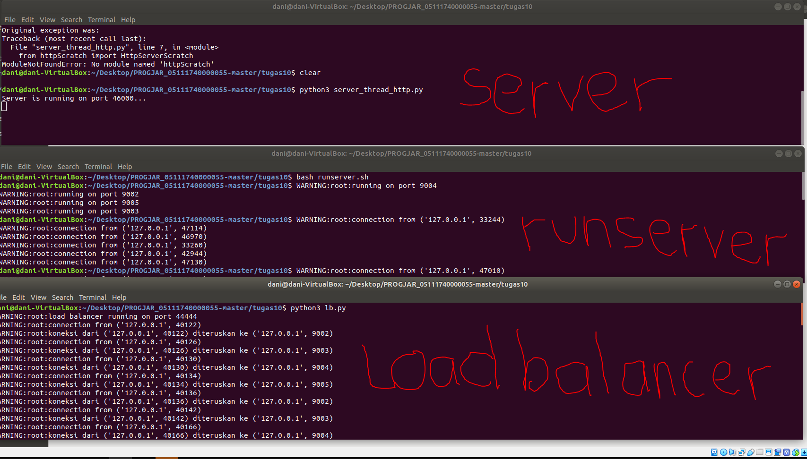
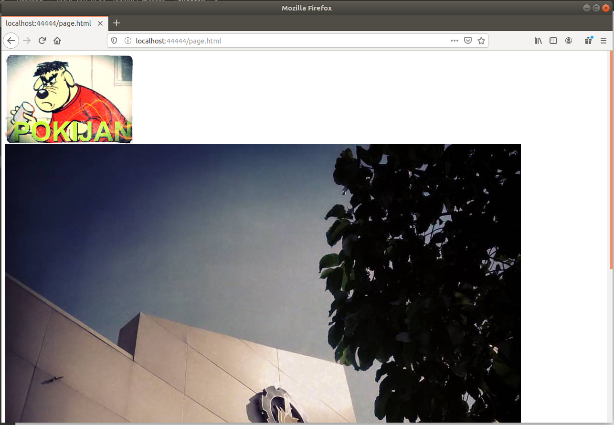
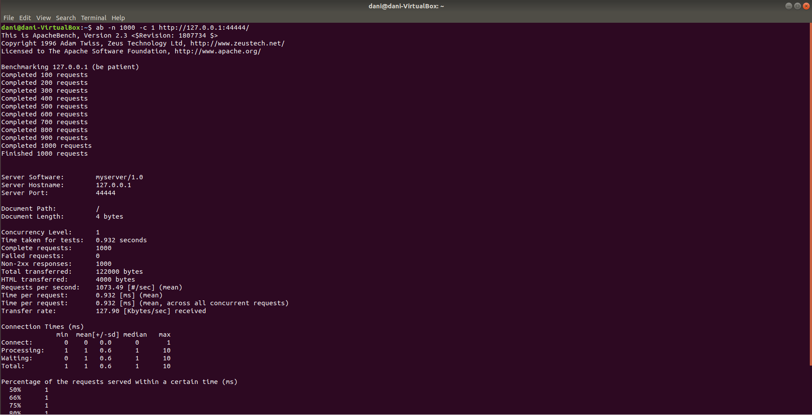
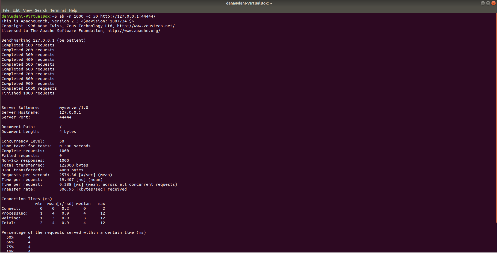
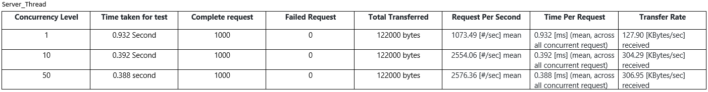
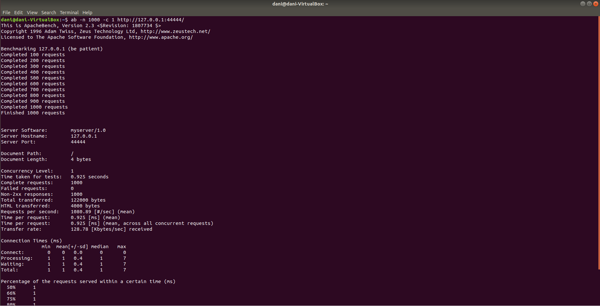
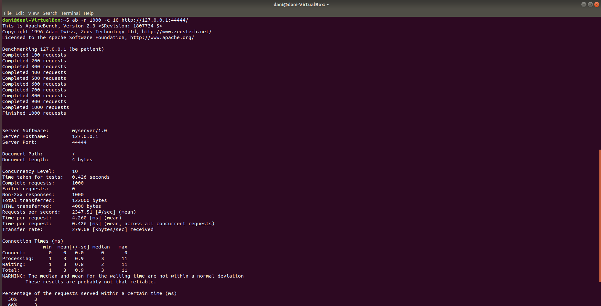
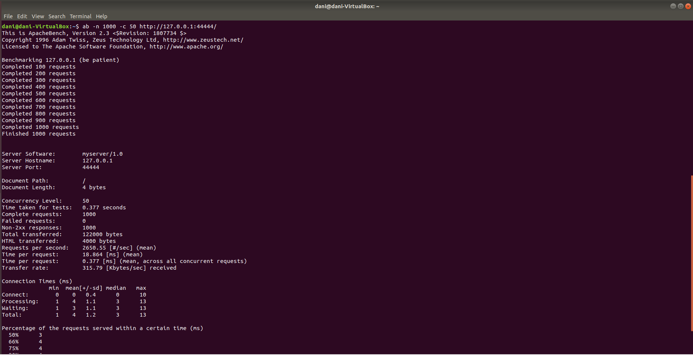
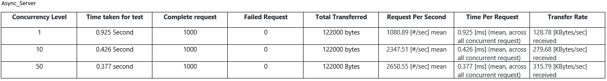

# Tugas 10 
## Hendra Ramadani (05111740000055)

Pertama-tama kita jalankan dulu server_thread / async_server , lalu kita jalankan runserver.sh dengan command `bash runserver.sh` , setelah itu yang terakhir kita jalankan load balancernya 

lalu coba kita akses http://localhost:44444/page.html

Untuk benchmarking menggunakan port dari loadbalancer
## Server_thread_http.py di port 44444
### 1. `ab -n 1000 -c 1 http://127.0.0.1:44444/`
1000 Request with 1 concurency

### 2. `ab -n 1000 -c 10 http://127.0.0.1:44444/`
1000 Request with 10 concurency

### 3. `ab -n 1000 -c 50 http://127.0.0.1:44444/`
1000 Request with 50 concurency

### Comparison Table

## Server_async_http.py di port 44444
### 1. `ab -n 1000 -c 1 http://127.0.0.1:44444/`
1000 Request with 1 concurency

### 2. `ab -n 1000 -c 10 http://127.0.0.1:44444/`
1000 Request with 10 concurency

### 3. `ab -n 1000 -c 50 http://127.0.0.1:44444/`
1000 Request with 50 concurency

### Comparison Table

