# Tugas 4

  1. Menjalankan Program 
  
    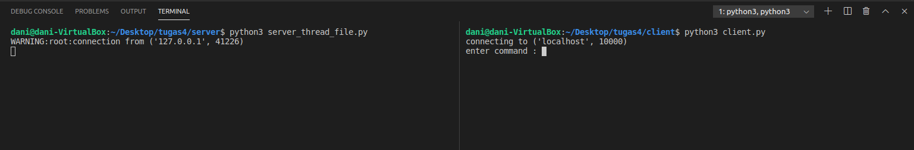

  2. Client 
  
    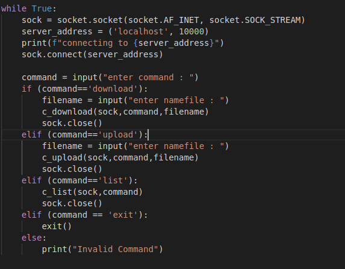

  3. List file Server
  
    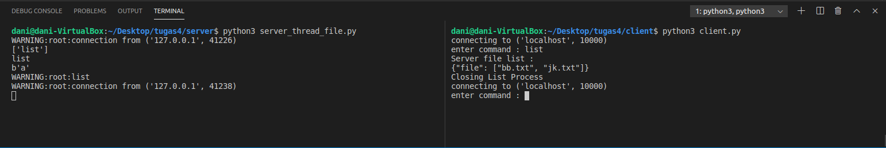

  4. Download File From Server
  
    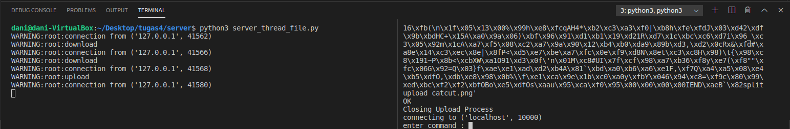

  5. Upload File To Server
  
    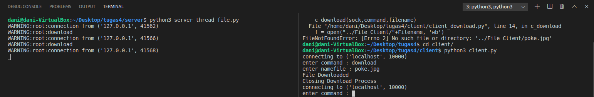

  6. Client Download Code
  
    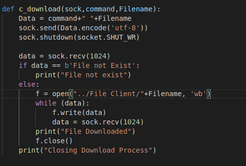

  7. Client Upload Code
  
    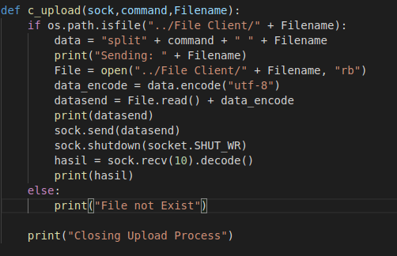

  8. Client List Code
  
    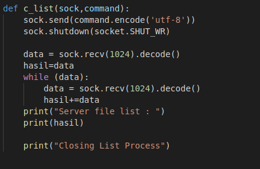

  9. Protocol 
  
    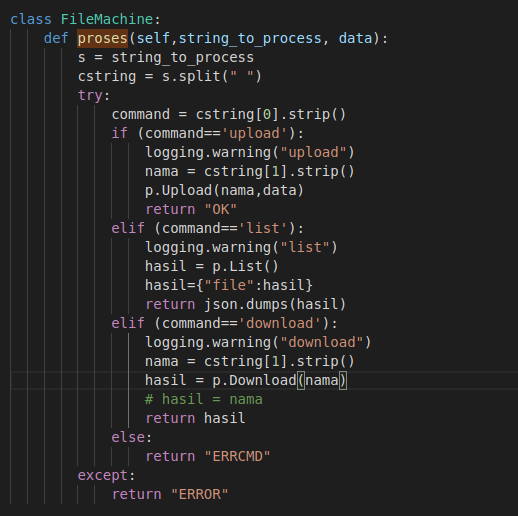

  10. Storage Server
  
    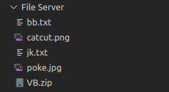

  11. Storage Client
  
    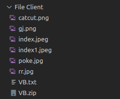
