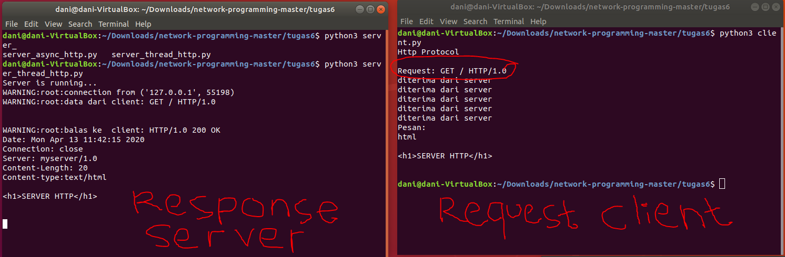
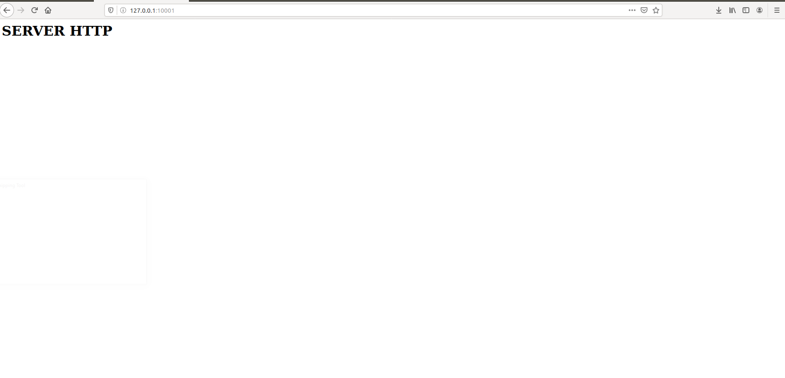
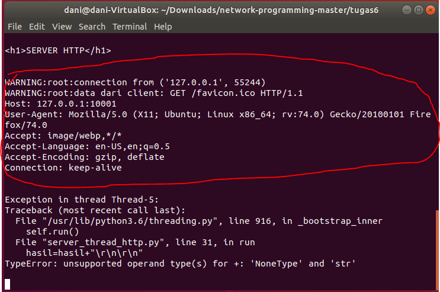

# Tugas 6

## Hasil dari Request client.py dan server meresponsenya

## Hasil dari Request telnet dan server meresponsenya

##  Output untuk Browser
Hasil ketika "127.0.0.1:10001" dibuka di browser

Response server ketika menjalankan request dari network developer mode

