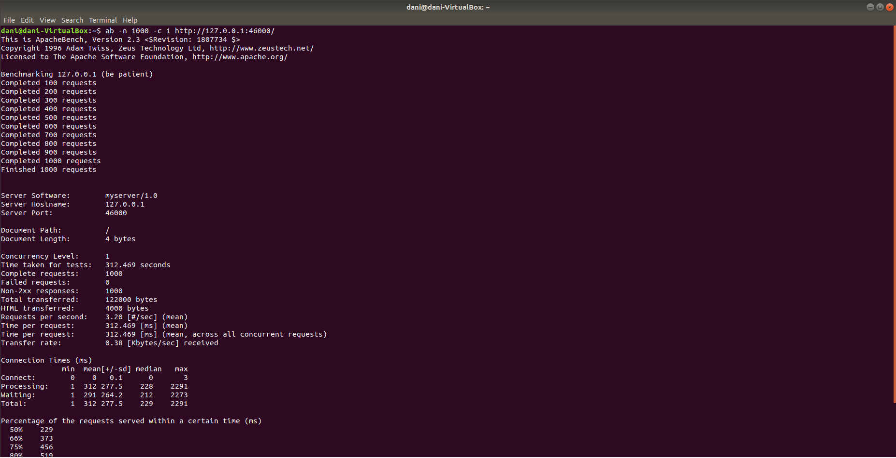
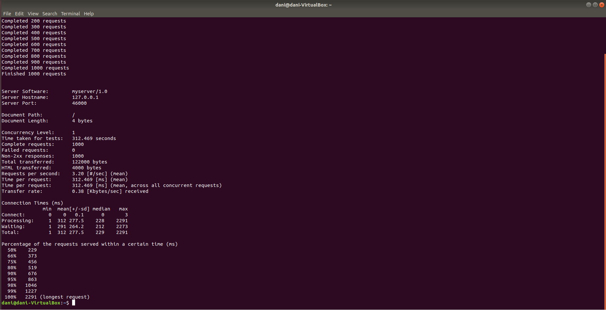
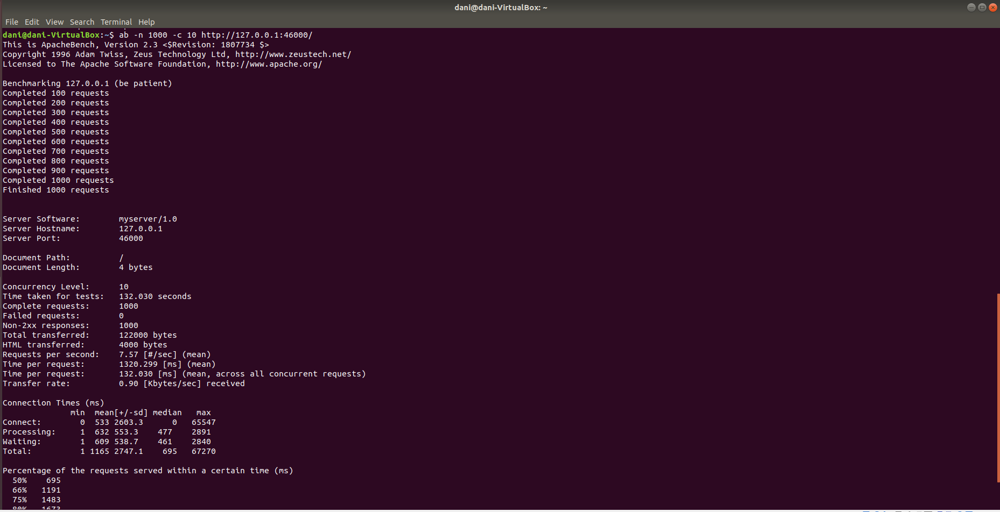
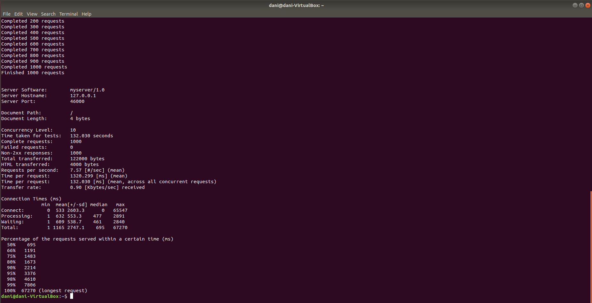
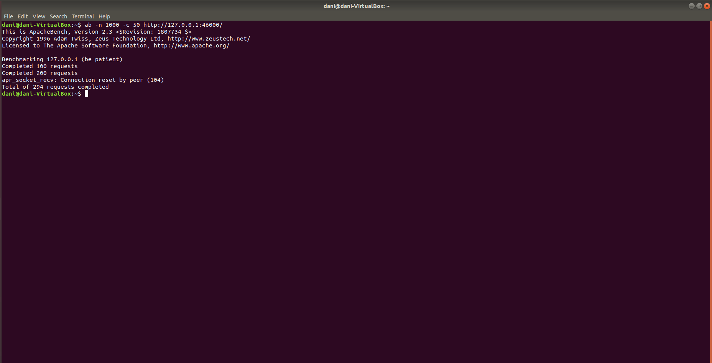
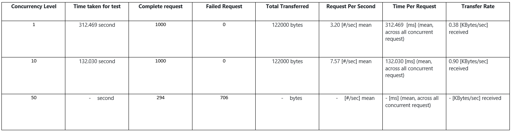

# Tugas 9 - asynchronous processing

## Server_thread_http.py di port 46000
### 1. `ab -n 1000 -c 1 http://127.0.0.1:46000/`
1000 Request with 1 concurency

### 2. ab -n 1000 -c 10 http://127.0.0.1:46000/
1000 Request with 10 concurency

### 3. ab -n 1000 -c 50 http://127.0.0.1:46000/
1000 Request with 50 concurency

### Comparison Table

## Server_async_http.py di port 45000
### 1. ab -n 1000 -c 1 http://127.0.0.1:45000/
1000 Request with 1 concurency

### 2. ab -n 1000 -c 10 http://127.0.0.1:45000/
1000 Request with 10 concurency

### 3. ab -n 1000 -c 50 http://127.0.0.1:45000/
1000 Request with 50 concurency

### Comparison Table
